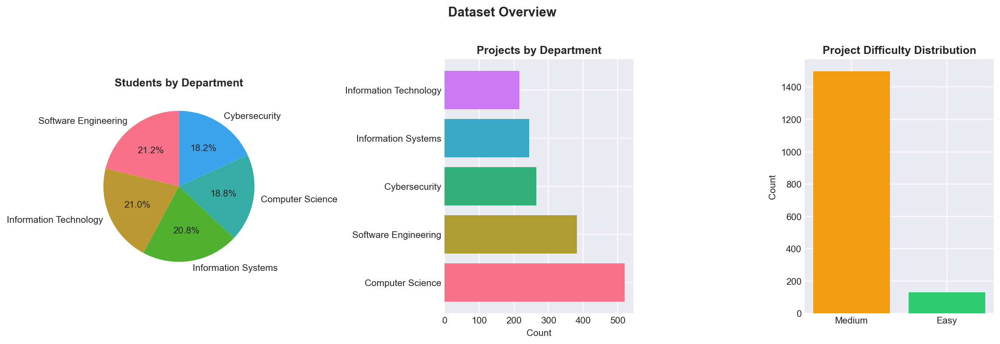
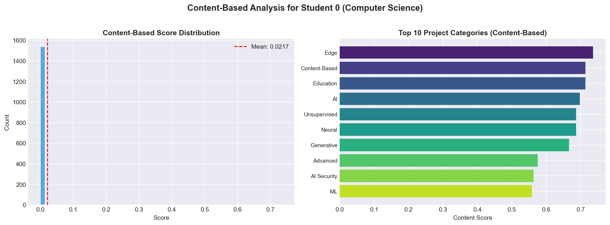
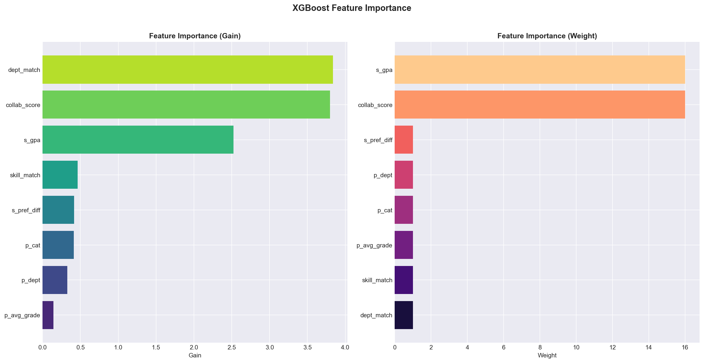
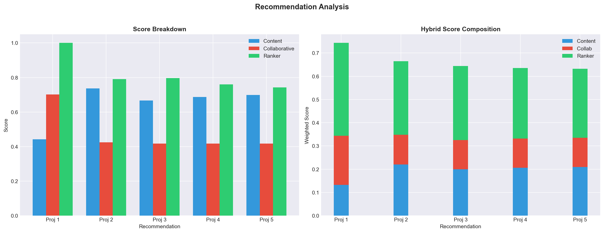

# Intelligent Final Year Project Recommendation System

This repository contains a student-project recommendation system for the Faculty of Computing at Nigerian Army University Biu. The system is designed to recommend the top five most suitable final-year project topics for a student based on their academic profile, technical skills, interests, and preferences.

## 📁 Repository Structure

- `dataset/`
  - `students.csv` — student profile data
  - `projects.csv` — project metadata and descriptions
  - `history.csv` — student interactions, grades, ratings, and completion status
- `models/` — saved recommender artifacts created by `train_recommender.py`
- `model/` — existing app inference artifacts used by `app.py`
- `plots/` — visualizations generated during analysis and training
- `train_recommender.py` — new training pipeline for the student-profile recommender
- `app.py` — Flask inference application with UI support
- `recommender_notebook.ipynb` — notebook version of the recommendation workflow
- `requirements.txt` — Python dependency list

## 🔍 Project Summary

This project builds an AI-powered recommendation system that:

- uses only student profile inputs
- learns from historical student-project interactions
- ranks candidate project topics by suitability
- returns the top 5 recommended project titles
- shows match scores and recommendation transparency

The current design emphasizes:

- academic profile features (department, GPA, year level, preferred difficulty)
- technical skills and interests
- content-based similarity between student interests and project metadata
- a binary classifier trained on successful past project interactions

## 🚀 Installation

1. Create a Python environment and install dependencies:

```bash
python -m pip install -r requirements.txt
```

2. Confirm the following directories exist:

- `dataset/`
- `plots/`
- `models/` or `model/`

## 🧠 Train the Recommender

The main training script is `train_recommender.py`.

```bash
python train_recommender.py
```

This script will:

- load student, project, and history data
- build student and project feature vectors
- generate a training dataset with positive and negative examples
- train an XGBoost binary classifier
- save artifacts into `models/`

Saved artifacts:

- `models/recommender.pkl`
- `models/scaler.pkl`
- `models/encoder.pkl`
- `models/vectorizer.pkl`
- `models/label_encoder.pkl`
- `models/metadata.json`

> Note: `app.py` currently loads inference artifacts from `model/`. If you want to use the new training artifacts, either copy or rename `models/` to `model/` or update `app.py` accordingly.

## 💻 Run the Flask App

Start the recommendation app:

```bash
python app.py
```

Then open your browser at:

```text
http://127.0.0.1:5000/
```

The app provides:

- a student input page
- project recommendation cards
- match and confidence scores
- an explanation-style summary of each recommendation

## 📘 Notebook Workflow

The notebook `recommender_notebook.ipynb` provides a complete interactive analysis and training flow, including:

- data inspection
- feature engineering
- training dataset construction
- model training
- top-5 recommendation examples

Open it in Jupyter or VS Code Notebook mode for step-by-step exploration.

## 📊 Key Visualizations

### Dataset Overview



### Content-Based Scores



### Feature Importance



### Recommendation Breakdown



## ✅ What This System Predicts

The recommender predicts ranked project topics for a student, not grades, completion status, or student IDs. It outputs:

- project title
- match/score probability
- confidence-style ranking
- feature-based explanation values such as skill overlap and interest similarity

## 🛠️ Notes and Tips

- The current Flask app expects `model/` artifacts. If `train_recommender.py` writes to `models/`, use `models/` as the artifact source or update `app.py`.
- The dataset can be extended with more students, research tags, or project descriptions to improve recommendation accuracy.
- `history.csv` is used to build a realistic target: completed projects with high ratings.

## 📌 Recommended Next Steps

- Align `app.py` with `train_recommender.py` artifact paths
- Add UI form fields for student interests and skill categories
- Expand the notebook to visualize recommendation explanations
- Add unit tests for feature extraction and inference logic

## 📄 Contact

This system is designed for the NAUB final-year project recommendation use case and is intended as a research-backed prototype for intelligent academic advising.
